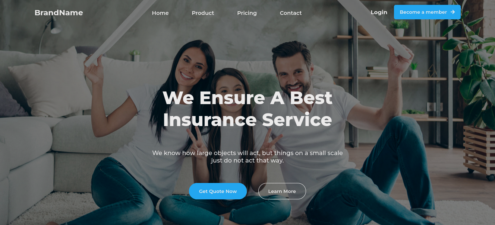

# Insurance_Website

## Table of Content

+ [Description](#description)
+ [Technology Used](#technology-used)
+ [Reference](#reference)
+ [Licence](#licence)
+ [Authors Info](#author-Info)

## Description
This landing page serves as a prime example of an insurance website designed using HTML, CSS, and responsive design techniques. The page has been meticulously crafted to provide a visually appealing and intuitive user experience, while also communicating key information about the insurance services offered by the website. The responsive design ensures that the website can be accessed seamlessly across various devices, providing users with a consistent and optimized experience. With its sleek and modern design, coupled with its user-centric approach, this landing page exemplifies the best practices of web design and is sure to leave a lasting impression on visitors.

### Screenshot

### Requirements

* Either a computer, smartphone, tablet or an Ipad

* Internet Access

[Go Back to the top](#Insurance_Website)
## Technology Used
* Semantic HTML5 Markup - Has been used to build the structure of the page.

* CSS Custom properties - Has been used to style the landing page incuding the navigation bar.

* Flexbox - Has been used to arrange the elements and make the website responsive.

### Links

- Live Site URL: [Insurance Landing Page](https://qurriahsam.github.io/insuarance-website/)

[Go Back to the top](#Insurance_Website)

## License

MIT License

Copyright (c) [2022] [Sam Kuria]

Permission is hereby granted, free of charge, to any person obtaining a copy
of this software and associated documentation files (the "Software"), to deal
in the Software without restriction, including without limitation the rights
to use, copy, modify, merge, publish, distribute, sublicense, and/or sell
copies of the Software, and to permit persons to whom the Software is
furnished to do so, subject to the following conditions:

The above copyright notice and this permission notice shall be included in all
copies or substantial portions of the Software.

THE SOFTWARE IS PROVIDED "AS IS", WITHOUT WARRANTY OF ANY KIND, EXPRESS OR
IMPLIED, INCLUDING BUT NOT LIMITED TO THE WARRANTIES OF MERCHANTABILITY,
FITNESS FOR A PARTICULAR PURPOSE AND NONINFRINGEMENT. IN NO EVENT SHALL THE
AUTHORS OR COPYRIGHT HOLDERS BE LIABLE FOR ANY CLAIM, DAMAGES OR OTHER
LIABILITY, WHETHER IN AN ACTION OF CONTRACT, TORT OR OTHERWISE, ARISING FROM,
OUT OF OR IN CONNECTION WITH THE SOFTWARE OR THE USE OR OTHER DEALINGS IN THE
SOFTWARE.

[Go Back to the top](#Insurance_Website)

## Authors Info

Linked - [Sam Kuria](https://www.linkedin.com/in/sam-kuria-0904b01a1)

[Go Back to the top](#Insurance_Website)
